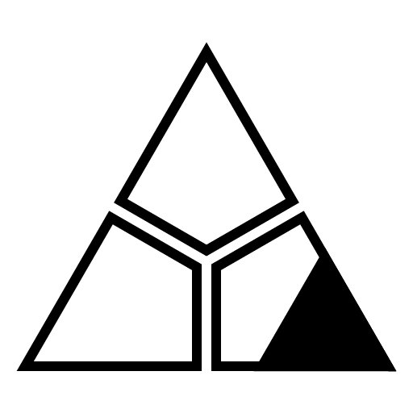
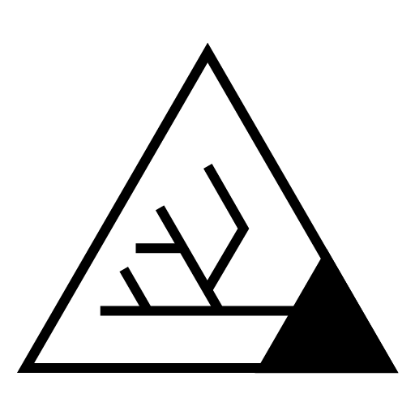
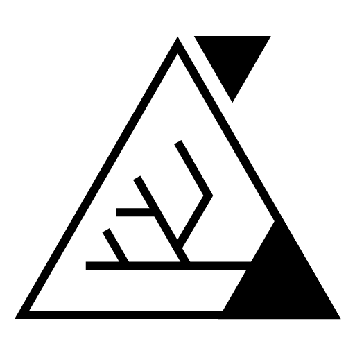

# Icons for nuget packages

Package | Icon
--- | ---
[StaticSharp.Core](https://www.nuget.org/packages/StaticSharp.Core) | 
[StaticSharp.MixinSourceGenerator](https://www.nuget.org/packages/StaticSharp.MixinSourceGenerator) | 
[StaticSharp.MixinSourceGenerator.Attributes](https://www.nuget.org/packages/StaticSharp.MixinSourceGenerator.Attributes) | 
[StaticSharp.StaticSharpSourceGenerator](https://www.nuget.org/packages/StaticSharp.StaticSharpSourceGenerator) | 
[StaticSharp.StaticSharpSourceGenerator.Attributes](https://www.nuget.org/packages/StaticSharp.StaticSharpSourceGenerator.Attributes) | 
[StaticSharp.RoslynSourceGeneratorLauncher](https://www.nuget.org/packages/StaticSharp.RoslynSourceGeneratorLauncher) | 

