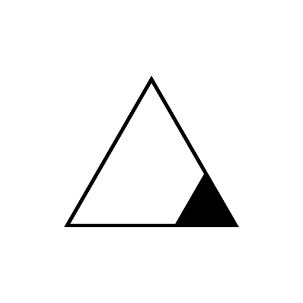

# brandAssets

## Logo

logo | png | svg | svg padding
--- | --- |--- | ---
 | [LogoHorizontal.png](LogoHorizontal.png) | [LogoHorizontal.svg](LogoHorizontal.svg) | [LogoHorizontalPadding.svg](LogoHorizontalPadding.svg)
 | [LogoHorizontalWhite.png](LogoHorizontalWhite.png) | [LogoHorizontalWhite.svg](LogoHorizontalWhite.svg) | [LogoHorizontalWhitePadding.svg](LogoHorizontalWhitePadding.svg)
 | [LogoVertical.png](LogoVertical.png) | [LogoVertical.svg](LogoVertical.svg) | [LogoVerticalPadding.svg](LogoVerticalPadding.svg)
 | [LogoVerticalWhite.png](LogoHorizontalWhite.png) | [LogoVerticalWhite.svg](LogoVerticalWhite.svg) | [LogoVerticalWhitePadding.svg](LogoVerticalWhitePadding.svg)

### Icons

logo | png | svg 
--- | --- |---
 | [Icon.png](Icon.png) | [Icon.svg](Icon.svg)
 | [IconWhiteSquare.png](IconWhiteSquare.png) | [IconWhiteSquare.svg](IconWhiteSquare.svg)
 | [IconWhiteRound.png](IconWhiteRound.png) | [IconWhiteRound.svg](IconWhiteRound.svg)
 | [IconDarkSquare.png](IconDarkSquare.png) | [IconDarkSquare.svg](IconDarkSquare.svg)
 | [IconDarkRound.png](IconDarkRound.png) | [IconDarkRound.svg](IconDarkRound.svg)
